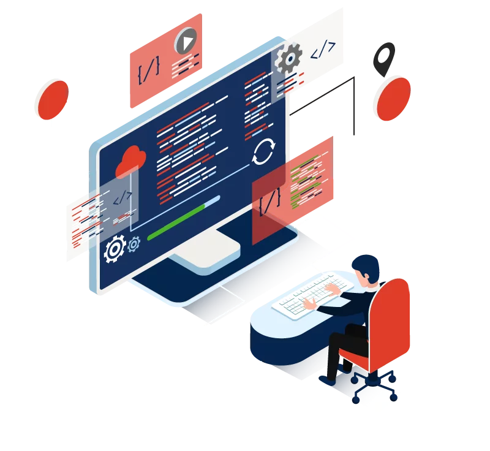

# Что значит научное программирование? 

Прежде всего, научное программирование должно быть ориентировано на эффективное и корректное решение поставленной задачи. Можно возразить, что эти требования предъявляются ко всем программным средствам. Однако вопрос в приоритете критериев. Скажем, если офисная программа будет работать не 0,25 секунд, а 1 секунду для обработки операции, то это не так критично, как скажем проведение расчета в течение недели или месяца. Тоже самое и на счет корректности выполнения программы. Одно дело, когда "зависнет" компьютерная игра, и совсем другое дело, если в ходе вычислений будет ошибка, которая приведет к неверным выводам или технологическим катастрофам.

# Основные моменты

Приведем некоторые моменты, которые следует иметь в виду, приступая к программированию научных задач.

Оптимизация текстов программ. Очень часто небольшое изменение в тексте программы позволяет кардинально увеличить скорость расчетов. Оптимизирующий компилятор не всесилен.

Не использовать внешние подпрограммы и библиотеки. За исключением особых случаев старайтесь программировать используемые алгоритмы сами. Во-первых, это даст исчерпывающее понимание самого численного метода, а, во-вторых, реализуя "для себя" можно добиться наилучшего результата.

Жертвуйте универсальностью в угоду эффективности. Универсальность одно из самых любимых достижений программирования, но для научного программирования построение универсальных программных комплексов оправдано не всегда.

Используйте современные компиляторы. Далеко не все можно оптимизировать "руками" - современные оптимизирующие компиляторы могут серьезно увеличить скорость.

# Выбор языка программирования. 

Издавна языком для научных расчетов являлся Фортран. Действительно, этот язык имеет много преимуществ, но еще больше недостатков. Таких как:

Язык старого поколения. Этот язык был разработан на заре компьютерной эры, поэтому многие важные технологии программирования, такие как модульность, контроль типов и др. в нем не реализованы. Что приводит к ошибкам и трудностям при программировании.

Многие библиотеки подпрограмм уже устарели. Прогресс в компьютерной сфере происходит крайне быстро. Поэтому библиотеки разработаны для устаревших ЭВМ могут быть бесполезны.

Отсутствие мобильности. Не смотря на существующие стандарты языка, конкретные реализации этого языка существенно отличаются.

# Преимущества C++

Выбор языка C# мотивируется следующими факторами:

Современный язык. Программирование это та область, в которой прогресс происходит очень быстро. Язык C# с одной стороны вобрал в себя лучшие черты языков C++ и Java, а с другой был создан без необходимости поддерживать совместимость с предыдущими версиями

Мощность платформы .NET. Язык C# является основным языком платформы .NET, поэтому при программировании на C# вы программируете также и на платформе .NET, которая предоставляет вам мощные, хорошо продуманные классы.

Эффективность языка. Как ни странно, но программы, написанные на C#, выполняемые на .NET, являются очень эффективно выполняемыми приложениями. Однако, при разработке сложных программ следует учитывать не только скорость выполнения программы, но и скорость разработки программы, а также сложность дальнейшей модификации. По этому параметру язык C# значительно превосходит классический язык C++.

В последние годы наблюдается возникновение новой вычислительной парадигмы - облачных вычислений (cloud computing), при которой создатель программы полностью абстрагируется от того, где будет происходить вычислительный процесс. Облачные вычисления подразумевают наличие значительных вычислительных мощностей, доступных через Интернет по требованию. На этих мощностях, располагающихся в центрах обработки данных (ЦОД), возможно развертывание интернет-приложений, веб-сервисов, услуг хранения и обработки данных и т.д. За счет концентрации вычислительных мощностей в экономически-привлекательных районах, повсеместного использования виртуализации и автоматизации контроля за работоспособностью узлов поставщики облачных услуг могут добиться существенное экономии от масштаба и высокой доступности и надежности предоставляемых сервисов.

Облачное приложение состоит из набора сервисов, работающих в центре обработки данных. При этом все вопросы запуска сервисов и поддержания их работоспособности берет на себя среда поддержки вычислений - от программиста требуется реализовать соответствующий программный код и файл с описанием и произвести развертывание. Как правило, облачное приложение состоит из вычислительных компонентов (это может быть веб-сервис, веб-приложение или вычислительный блок, не требующий взаимодействия с пользователем) и хранилища данных, которое мы отличаем здесь от термина "база данных" , поскольку из-за необходимости масштабирования как правило применяются нереляционные хранилища. Вычислительные компоненты как правило программируются в модели "без состояния" (stateless), что дает возможность в случае отказа перезапустить соответствующий компонент без нарушения работоспособности приложения. Кроме того, среда позволяет запустить вычислительную компоненту на нескольких виртуальных серверах одновременно и использовать балансировку нагрузки для повышения производительности.

Следует отметить, что не любая задача может эффективно вычисляться на облачном кластере в такой архитектуре. В отличие от традиционного компьютерного кластера, в котором имеется высокоскоростной канал обмена данными между узлами, в указанной архитектуре обмен осуществляется через низкоскоростное внешнее хранилище данных. Теоретически, возможно организовать прямой сетевой обмен между экземплярами вычислительных ролей, однако такой подход выходит за рамки настоящего курса. В любом случае следует понимать, что облачные вычисления не являются заменой высокопроизводительным вычислительным кластерам, и скорость обмена данными между узлами у них ниже. Тем не менее, есть значительное количество задач, которые не требуют существенного обмена данными между узлами в процессе вычислений. В качестве примера, можно рассмотреть задачи независимого перебора, в которых можно изначально разбить пространство поиска на непересекающиеся подпространства, поиск в которых будет производиться независимыми вычислительными ролями.
